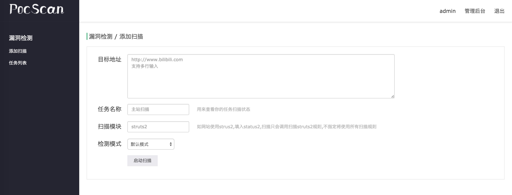
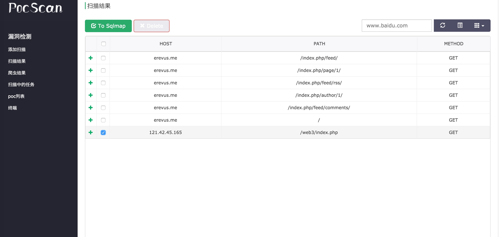
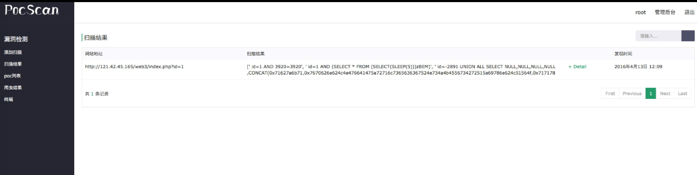

## POCSCAN

 Pocscan是一款开源 Poc 调用框架,可轻松调用Pocsuite,Tangscan,Beebeeto,Knowsec老版本POC 按照官方规范编写的 Poc对目标域名进行扫描，通过 Docker 一键部署，麻麻再也不怕搭建麻烦了 。
 
Pocscan支持被动式扫描,还提供了chrome浏览器插件,插件会自动抓取你访问的网站host进行漏洞扫描。ε=ε=(ノ≧∇≦)ノ
 
 Pocscan 只是扫描框架，不提供Poc!!!  
 Pocscan 只是扫描框架，不提供Poc!!!  
 Pocscan 只是扫描框架，不提供Poc!!!  
 
### Screenshots

### Installation

1. 安装Docker, 然后下载镜像

    	$ sudo curl -sSL https://get.daocloud.io/docker | sh 
    	$ sudo systemctl start docker
    	$ sudo docker pull daocloud.io/aber/pocscan:latest
    	$ sudo chmod -R 0777 [代码存放目录]
    	
2. 把源码 clone 到本地,运行 docker 容器,把源码挂载到容器里

        sudo docker run -d -v [代码存放目录的绝对路径]:/www -p 8090:8000 -p 8088:8088 daocloud.io/aber/pocscan:latest
    	
    	/*
    	-p 8090:8000 是将容器的8000端口映射到宿主机的8090端口
    	以上参数根据实际情况自行配置
    	*/
    	
    	
3. 把poc文件按找分类放到 /pocscan/pocs/ 下的文件夹

4. 访问一下 http://127.0.0.1:8090/login. 出现登录界面就是搭建成功了。后台和终端的帐号是root,密码是password.

5. 安装chrome插件(代码根目录那个crx文件),装好设置好API地址.要扫描时保持插件页面的打开。
	
		http://192.168.1.2:8090/chromeapi/     #注意chromeapi后面要用"/",注意chromeapi后面要用"/",注意chromeapi后面要用"/"。重要的事情说三次

### How to update

        $ sudo docker pull daocloud.io/aber/pocscan:latest
        $ cd [代码存放目录]
        $ [备份本地poc]
        $ git pull 
        $ sudo docker run -d -v [代码存放目录的绝对路径]:/www -p 8090:8000 -p 8088:8088 daocloud.io/aber/pocscan:latest
 		
 		
### TO DO

1. XSS 检测
2. 分布式

### FAQ

Q: 搭建为啥扫不出漏洞啊？(ﾟДﾟ≡ﾟдﾟ)!?

A: Pocscan 只是提供一个框架，不提供 Poc (其实还是提供了demo poc的), 扫不出洞说明你的 Poc 不够多不够牛逼。

Q: POC 哪里找？

A：上sebug.net,tangscan.com,beebeeto.com兑换.或者自己写.

Q: 不知道我的poc有没有运行啊,怎么进行debug?

A: 1.可以选择进入web终端,/var/log/supervisor目录下看celery的日志.

   2.使用flower查看任务状态,但是导致未授权访问漏洞，sudo docker run -d -v [代码存放目录]:/www -p 8090:8000 -p 8088:8088 -p 5555:5555 daocloud.io/aber/pocscan:latest。然后访问5555端口
   

### Update log

2016.3.22 v1.1.1 增加终端功能,可以进终端进行安装py依赖解决poc依赖库的问题

2016.4.15 v2.0 增加爬虫和sqlmap功能

2016.4.19 v2.1 增加chrome插件,增加chromeapi

2016.4.22 v2.2 chrome增加选择模式

2016.6.27 v3.0 支持bugscan插件

2016.7.6 v3.0.1 修复bugscan文件名load error bug,修复bugscan部分插件不能使用的问题(bugscan架构真有问题，给跪了)

### 问题反馈 当程序出现日天的bug，或者你有更好的建议想法时，请提issue

__author__ : 只有两人bilibili安全团队,erevus, tlskbz
